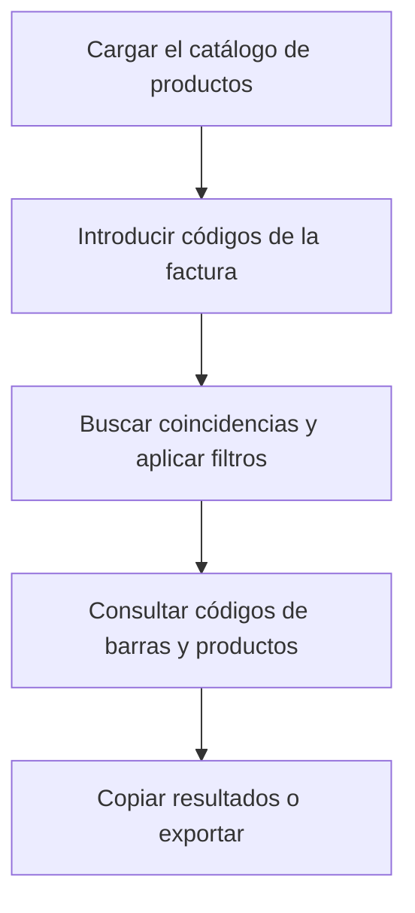

# Buscador de códigos

**Del código de una factura al código de barras del producto, con una consulta al catálogo.**

Aplicación de escritorio en Python que reúne búsqueda de productos, administración de proveedores y preparación de archivos para operaciones masivas en Tivendo.

## El problema que resuelve

En el trabajo diario había que buscar manualmente cada código de la factura para encontrar el código de barras del producto. Esta herramienta permite introducir el código de la factura y consultar su correspondencia en el catálogo cargado. La búsqueda por lotes facilita trabajar con varios productos en una misma operación.

El resultado es un flujo con menos consultas repetitivas y con opciones para copiar o exportar los datos encontrados.

## Flujo principal



## Funciones

- Búsqueda por código, nombre y código de barras, con coincidencia exacta o parcial.
- Entrada de varios códigos y filtro por proveedor.
- Copia de códigos de barras, nombres y códigos no encontrados; exportación de resultados.
- Administración del listado de proveedores.
- Preparación de cambios masivos de precios y altas de artículos para importar en Tivendo, con vista previa.
- Descarga automatizada de información de Tivendo mediante Playwright, cuando se configura el acceso correspondiente.
- Caché de datos y tareas de carga en segundo plano para mantener disponible la interfaz.

## Tecnologías

**Python**, Tkinter/ttk, pandas, NumPy, openpyxl y Playwright. El código principal está en [`buscador_codigos.py`](buscador_codigos.py).

## Ejecutar desde el código

Se necesita Python 3 con Tkinter disponible. En Windows, desde la carpeta del repositorio:

```powershell
python -m venv .venv
.\.venv\Scripts\python.exe -m pip install numpy pandas openpyxl playwright
.\.venv\Scripts\python.exe -m playwright install chromium
.\.venv\Scripts\python.exe buscador_codigos.py
```

Las dependencias no tienen versiones fijadas en este repositorio. Estos comandos corresponden a los paquetes utilizados por el código; no constituyen una matriz de compatibilidad entre versiones.

Las versiones distribuidas se conservan en [Releases](https://github.com/FoorKeM/buscador-de-codigos/releases) y en los tags del repositorio. Se mantiene un archivo principal de desarrollo, en lugar de copiar el programa con un nombre nuevo en cada versión.

## Uso

1. Cargar un listado compatible de productos o utilizar la descarga automatizada si el entorno está configurado.
2. Abrir la búsqueda e introducir uno o varios códigos de una factura.
3. Revisar las coincidencias y filtrar por proveedor cuando corresponda.
4. Copiar los códigos de barras o exportar los resultados.
5. Para cambios de precios o altas masivas, utilizar el módulo correspondiente y revisar la vista previa antes de generar el archivo de importación.

## Comprobación y límites

El repositorio no incluye una suite de pruebas automatizadas. Una comprobación manual debe cubrir códigos conocidos, códigos inexistentes, consultas por lotes, filtros y exportación, utilizando un catálogo de prueba.

La correspondencia entre código de factura y código de barras depende de los datos disponibles en el catálogo. Los formatos de importación deben ser compatibles con los que espera la aplicación. Las funciones conectadas a Tivendo requieren una cuenta autorizada y pueden necesitar mantenimiento cuando cambie su interfaz web.

La búsqueda local puede revisarse con datos de prueba. Las operaciones conectadas y las importaciones deben validarse en un entorno autorizado antes de aplicarlas a información operativa.

---

Proyecto del catálogo de [Sebastian Araya — Sistemas, Logística y Automatización](https://github.com/FoorKeM).
